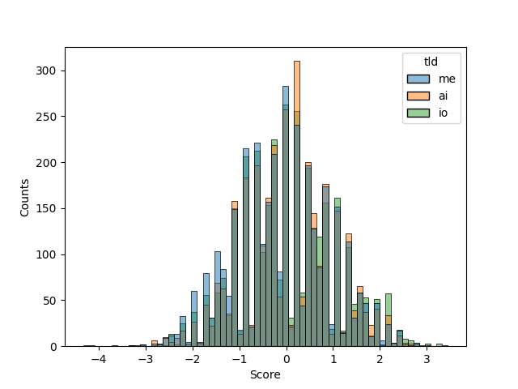

# QR Code Tattoo Generator

[Related blog post](https://samantha.wiki/projects/qr-code-tattoo/)

This project generates domains randomly and scores their corresponding QR codes on how "feasible" they are as a tattoo. E.g. minimizing the number of borders between pixels of varying values, etc.

Also see the [related api](https://github.com/samanthavbarron/api) that you can use to update what the QR code redirects to (e.g. from iOS shortcuts, etc).

# Distribution of Scores

## Good QR Code Examples

## Bad QR Code Examples

